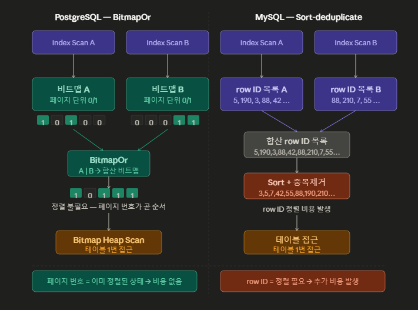

# OR 조건을 UNION ALL로 성능 개선
OR 조건을 넣었을 때와 UNION ALL을 사용했을 때의 실행 계획을 비교한다.

인덱스 : `create index idx_orders_status on orders (status);`, `create index idx_orders_total_amount on orders (total_amount);`

## Step 1. 좁은 범위 OR 조건

쿼리 : `select * from orders where status = 'X' or total_amount >= 490000;`

```
------------------------------------------------------------------------------------------------------------------------------------------
 Bitmap Heap Scan on orders  (cost=124.40..1752.57 rows=10457 width=22) (actual time=0.314..1.661 rows=10408 loops=1)
   Recheck Cond: ((status = 'X'::bpchar) OR (total_amount >= 490000))
   Heap Blocks: exact=1471
   ->  BitmapOr  (cost=124.40..124.40 rows=10478 width=0) (actual time=0.204..0.205 rows=0 loops=1)
         ->  Bitmap Index Scan on idx_orders_status  (cost=0.00..111.84 rows=10073 width=0) (actual time=0.195..0.195 rows=10000 loops=1)
               Index Cond: (status = 'X'::bpchar)
         ->  Bitmap Index Scan on idx_orders_total_amount  (cost=0.00..7.33 rows=405 width=0) (actual time=0.009..0.009 rows=408 loops=1)
               Index Cond: (total_amount >= 490000)
 Planning Time: 0.102 ms
 Execution Time: 1.908 ms
(10 rows)
```
## Step 2. 넓은 범위 OR 조건

쿼리 : `select * from orders where status = 'C' or status = 'D';`

```
---------------------------------------------------------------------------------------------------------------
 Seq Scan on orders  (cost=0.00..4471.00 rows=120046 width=22) (actual time=0.010..11.826 rows=140000 loops=1)
   Filter: ((status = 'C'::bpchar) OR (status = 'D'::bpchar))
   Rows Removed by Filter: 60000
 Planning Time: 0.061 ms
 Execution Time: 14.801 ms
(5 rows)
```

## Step 3. Step 1 UNION ALL 튜닝

쿼리 : `select * from orders where status = 'X' union all select * from orders where total_amount >= 490000;`

```
------------------------------------------------------------------------------------------------------------------------------------------
 Append  (cost=114.36..2674.76 rows=10478 width=22) (actual time=0.286..2.265 rows=10408 loops=1)
   ->  Bitmap Heap Scan on orders  (cost=114.36..1711.27 rows=10073 width=22) (actual time=0.286..1.608 rows=10000 loops=1)
         Recheck Cond: (status = 'X'::bpchar)
         Heap Blocks: exact=1471
         ->  Bitmap Index Scan on idx_orders_status  (cost=0.00..111.84 rows=10073 width=0) (actual time=0.196..0.196 rows=10000 loops=1)
               Index Cond: (status = 'X'::bpchar)
   ->  Bitmap Heap Scan on orders orders_1  (cost=7.43..911.10 rows=405 width=22) (actual time=0.050..0.212 rows=408 loops=1)
         Recheck Cond: (total_amount >= 490000)
         Heap Blocks: exact=408
         ->  Bitmap Index Scan on idx_orders_total_amount  (cost=0.00..7.33 rows=405 width=0) (actual time=0.024..0.024 rows=408 loops=1)
               Index Cond: (total_amount >= 490000)
 Planning Time: 0.103 ms
 Execution Time: 2.562 ms
(13 rows)
```

## Step 4. Step 2 UNION ALL 튜닝

쿼리 : `select * from orders where status = 'C' union all select * from orders where status = 'D';`

```
--------------------------------------------------------------------------------------------------------------------------------------------
 Append  (cost=1118.93..6964.62 rows=140120 width=22) (actual time=1.642..17.195 rows=140000 loops=1)
   ->  Bitmap Heap Scan on orders  (cost=1118.93..3839.34 rows=99953 width=22) (actual time=1.641..7.463 rows=100000 loops=1)
         Recheck Cond: (status = 'C'::bpchar)
         Heap Blocks: exact=1471
         ->  Bitmap Index Scan on idx_orders_status  (cost=0.00..1093.94 rows=99953 width=0) (actual time=1.530..1.530 rows=100000 loops=1)
               Index Cond: (status = 'C'::bpchar)
   ->  Bitmap Heap Scan on orders orders_1  (cost=451.59..2424.68 rows=40167 width=22) (actual time=0.607..3.693 rows=40000 loops=1)
         Recheck Cond: (status = 'D'::bpchar)
         Heap Blocks: exact=1471
         ->  Bitmap Index Scan on idx_orders_status  (cost=0.00..441.55 rows=40167 width=0) (actual time=0.521..0.521 rows=40000 loops=1)
               Index Cond: (status = 'D'::bpchar)
 Planning Time: 0.083 ms
 Execution Time: 20.311 ms
(13 rows)
```

## 정리

책과 대부분의 블로그에서는 OR 조건을 사용하면 인덱스를 제대로 타지 못하고, UNION ALL을 사용하는 것으로 성능 향상을 기대할 수 있다고 나와있다.
이를 실제로 실험한 결과는 그렇지 않았다.

Step 1과 Step 3을 비교해보자.

### Step 1.
```
Bitmap Heap Scan on orders  (cost=124.40..1752.57 rows=10457 width=22) (actual time=0.314..1.661 rows=10408 loops=1)
   Recheck Cond: ((status = 'X'::bpchar) OR (total_amount >= 490000))
   Heap Blocks: exact=1471
   ->  BitmapOr  (cost=124.40..124.40 rows=10478 width=0) (actual time=0.204..0.205 rows=0 loops=1)
         ->  Bitmap Index Scan on idx_orders_status  (cost=0.00..111.84 rows=10073 width=0) (actual time=0.195..0.195 rows=10000 loops=1)
               Index Cond: (status = 'X'::bpchar)
         ->  Bitmap Index Scan on idx_orders_total_amount  (cost=0.00..7.33 rows=405 width=0) (actual time=0.009..0.009 rows=408 loops=1)
               Index Cond: (total_amount >= 490000)
```

Bitmap Index Scan을 2번 진행하고 이를 BitmapOr을 사용하여 비트맵 A와 비트맵 B를 합친다. 그 후 Bitmap Heap Scan을 진행하여 실제 테이블에 접근한다.

### Step 3.
```
------------------------------------------------------------------------------------------------------------------------------------------
 Append  (cost=114.36..2674.76 rows=10478 width=22) (actual time=0.286..2.265 rows=10408 loops=1)
   ->  Bitmap Heap Scan on orders  (cost=114.36..1711.27 rows=10073 width=22) (actual time=0.286..1.608 rows=10000 loops=1)
         Recheck Cond: (status = 'X'::bpchar)
         Heap Blocks: exact=1471
         ->  Bitmap Index Scan on idx_orders_status  (cost=0.00..111.84 rows=10073 width=0) (actual time=0.196..0.196 rows=10000 loops=1)
               Index Cond: (status = 'X'::bpchar)
   ->  Bitmap Heap Scan on orders orders_1  (cost=7.43..911.10 rows=405 width=22) (actual time=0.050..0.212 rows=408 loops=1)
         Recheck Cond: (total_amount >= 490000)
         Heap Blocks: exact=408
         ->  Bitmap Index Scan on idx_orders_total_amount  (cost=0.00..7.33 rows=405 width=0) (actual time=0.024..0.024 rows=408 loops=1)
               Index Cond: (total_amount >= 490000)
```

Step 3는 Step 1과 달리 Bitmap Index Scan을 각각 하는 것은 동일하지만 이를 합치지 않고 2번의 테이블 스캔을 해버린다.

### MySQL에서도 해보았다.

1. OR
```
-> Filter: ((orders.`status` = 'X') or (orders.total_amount >= 490000))  (cost=10075 rows=10408) (actual time=3.58..9.99 rows=10408 loops=1)
    -> Sort-deduplicate by row ID  (cost=10075 rows=10408) (actual time=3.58..9.24 rows=10408 loops=1)
        -> Index range scan on orders using idx_orders_status over (status = 'X')  (cost=1010 rows=10000) (actual time=0.105..1.55 rows=10000 loops=1)
        -> Index range scan on orders using idx_orders_total_amount over (490000 <= total_amount)  (cost=42.2 rows=408) (actual time=0.0046..0.0665 rows=408 loops=1)
```
2. UNION ALL
```
-> Append  (cost=1593 rows=10408) (actual time=0.6..8.4 rows=10408 loops=1)
    -> Stream results  (cost=1409 rows=10000) (actual time=0.599..7.62 rows=10000 loops=1)
        -> Index lookup on orders using idx_orders_status (status='X')  (cost=1409 rows=10000) (actual time=0.594..6.65 rows=10000 loops=1)
    -> Stream results  (cost=184 rows=408) (actual time=0.116..0.324 rows=408 loops=1)
        -> Index range scan on orders using idx_orders_total_amount over (490000 <= total_amount), with index condition: (orders.total_amount >= 490000)  (cost=184 rows=408) (actual time=0.114..0.282 rows=408 loops=1)
```
여기서는 오히려 OR 조건이 더 느리게 나왔다.
테이블 스캔을 2번하는 것보다 Sort-deduplicate 하는 비용이 커서 그런것이다.

아래는 Postgres의 BitmapOr과 MySQL의 sort-deduplicate의 차이이다.
둘다 테이블의 접근을 줄이려는 것은 맞지만 MySQL의 sort-deduplicate은 rowID를 정렬하는 비용이 들어 시간이 더 많이 걸린 것이다.


### 결론
데이터베이스 별로 옵티마이저의 쿼리 계획과 실행 계획의 내부동작이 조금씩 다른 것을 확인했다.

1. 블로그에서는 "OR -> UNION ALL이 빠르다"라고 설명했지만 DBMS 버전과 인덱스 유무에 따라 결론이 달라진다. 항상 EXPLAIN ANALYZE로 직접 확인해야한다.
2. PostgreSQL과 MySQL의 OR 처리 방식 차이
   - PostgreSQL은 처음부터 페이지 번호 기준 비트맵으로 관리해서 정렬 비용이 없다.
   - MySQL은 row ID를 수집한 뒤 정렬하는 Sort-deduplicate 방식이라 추가 비용이 발생한다.
   - 같은 조건에서 PostgreSQL은 OR가, MySQL은 UNION ALL이 더 빠르다는 결과가 나왔다.
3. 넓은 범위의 OR 조건에서 옵티마이저는 Seq Scan을 선택한다.

AI의 답변 - UNION ALL 튜닝의 현재 의미: MySQL 5.x, Oracle 9i 시절에는 OR 조건에서 인덱스를 하나밖에 못 탔기 때문에 UNION ALL이 확실히 유효했습니다. 현대 옵티마이저는 두 인덱스를 동시에 활용하는 방식으로 고도화되어 있어서 인덱스가 양쪽 다 있으면 UNION ALL로 바꿀 이유가 줄어들었습니다.